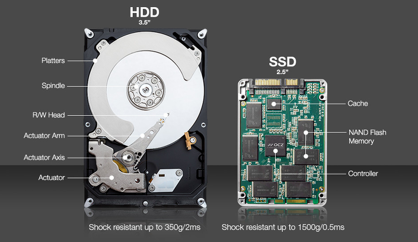

---
tags:
    - CS
---

# The Memory Hierarchy

➰　System programming <br>
➰　메모리 시스템 Memory System <br>
➰　저장 장치들의 계층구조

상위 계층일수록 작고, 비싸고, 빠른 접근이 가능<br>
좋은 지역성(**Locality**)를 갖는 프로그램은 나쁜 지역성을 가진 프로그램보다 좀 더 상위 메모리 계층에서, 더 많은 데이터에 접근하려는 경향이 있으며, 더 빨리 돎<br>
Locality에 따라 응용 성능이 크게 달라짐

## 🎇 휘발성 메모리 Volatile Memory
### 📌 RAM (Random Access Memory)
#### ⚡ Volatile(휘발성) : “Lose information if the supply voltage is turned off.”
- 전원이 공급되지 않으면 메모리에 들어있던 정보들이 소멸
- 모든 데이터를 RAM에 저장하는 것은 비용과 전력 사용 면에서 비효율적

### 📌 RAM의 종류
#### ⚡ SRAM (Static RAM 정적램)
- 집적도가 낮고 전력 소모가 많고 구조가 복잡해서 용량이 작지만 속도는 매우 빠름
- CPU의 캐시 메모리로 주로 사용
- ➰　Persistent : 전원 공급만 있으면 메모리가 절대로 사라지지 않음
- 자외선, 전파, 전기에 강함
- ➰　Lower Density : 1bit 당 트랜지스터 6개 필요
#### ⚡ DRAM (Dynamic RAM 동적램)
- 집적도가 높고 전력소모가 적고 구조가 간단해서 용량이 큰 편
- 메인 메모리와 그래픽 시스템의 프레임 버퍼로 사용
    - 일반적인 PC용 메모리
- ➰　Need Refresh : 전원이 공급되어 있어도 메모리가 주기적으로 사라짐
- 1bit 당 트랜지스터 1개 필요
    - SRAM에 비해 용량이 6배 정도 큼
- DRAM 칩 내 셀은 w DRAM 셀로 이루어진 d 슈퍼셀로 구성
    - d × w DRAM칩은 d 슈퍼셀, 슈퍼셀당 8비트를 가짐

```
🔥 데이터는 ‘버스 Bus’라고 하는 공유 전기회로를 통해 CPU와 DRAM 메인 메모리 앞뒤로 교환

 > Read Transaction : 데이터를 메인메모리에서 CPU로 이동
 > Write Transaction : 데이터를 CPU에서 메인메모리로 이동
```

## 🎇비휘발성 메모리 Non-volatile Memory
### 📌 ROM (Read-Only Memory)
➰　Read-Only 지만, 일부 쓰기도 가능

### 📌 ROM의 종류
#### ⚡ MROM (Mask ROM)
- 제품 **생산 시** 메모리에 내용을 **기록**하는 형태
- 최초 프로그램 이후 삭제나 재 기록이 불가능

#### ⚡ PROM (Programmable ROM) or FPROM (Field Programmable ROM)
- 생산 시 메모리가 비어 있음
- 이후 사용자에 의해 **딱 한번 프로그램** 될 수 있는 메모리, 그 다음 Read-Only

#### ⚡ EPROM (Erasable PROM) or UV EPROM (Ultraviolet EPROM)
- 하드웨어적으로 메모리 수명이 다할 때까지 재기록 가능
- 기본적으로 기록한 데이터는 사라지지 않음
- 장치에서 메모리를 제거하여 Ultraviolet Light를 이용해 지우고 롬라이터 등의 장치를 이용해 재프로그램 가능
- 기록된 내용 전체를 한번에 지움

#### ⚡ EEPROM (Electrically Erasable PROM)
- 전기 신호로 데이터를 지우는 PROM
- 바이트 단위로 내용을 지우고 기록할 수 있음
- 별도의 장치 없이 장착 상태 그대로 수정이 가능하지만 기록 속도가 느림

#### ⚡ Flash Memories
- EEPROM에 기반한 비휘발성 메모리
- (모바일 등 전자기기에서) 빠르고 안정적인 비휘발성 저장장치의 역할을 수행
- **Block** 단위(보통 512 byte, like Sector)로 기록하기 때문에 속도가 빠름
- ➰　No in-place writes
    - 이미 데이터가 있는 곳에 덮어쓰지 못 함
- ➰　Asymmetric read-write speed
    - write보다 read가 훨씬 빠름
- ➰　Write는 데이터 옮겨쓰기, 지우기 등을 포함
- ➰　10만번 정도 지우면 사용할 수 없음 == 버리는 영역
- ➰　NAND flash / NOR flash
    - 보통 NAND FLASH를 더 많이 씀
- ➰　SSD (Solid State Dish)
    - 하드디스크보다 비싸고 가볍고 충격에 강함
    - **Solid State**? 하드디스크와 달리 디스크들을 움직이는 부분이 없음!

##### 🔥 하드디스크 HDD
- ➰　Disk = Platters 원판 + Spindle 회전축
- Platters 원판 윗면, 아랫면 2개의 Surfaces로 데이터를 저장
- 각 Surface는 track으로 불리는 Concentric ring으로 구성 (10,000개 내외)
- SRAM보다 40,000배, DRAM보다 2,500배 느림

    

##### 🔥 SSDs (Solid State Disks)
- ➰　(구성) = 한 개 이상의 플래시 메모리 칩 + 디스크 컨트롤러 FTL (Flash Translation Layer)
- Page 단위로 데이터를 읽고 씀, 지우기는 Block 단위로만 가능
- 하나의 Page를 지우려면, 같은 Block의 나머지 페이지를 빈 Block으로 옮겨야 함
- HDD와 달리 Mechanical Move가 없어 ***빠르고, 전력 소모도 적고, 견고함***
- 한 Block당 10만번 이상 쓰기를 반복하면 Wear Out된다는 점과 비싸다는 점이 단점

#### ⚡ NVRAM (Non Volatile RAM)
- ➰　비휘발성 RAM : 전원을 차단해도 데이터를 유지하는 RAM
- 정확히는 비휘발성 SRAM(Static RAM)
- 집적도가 낮고 전력소모가 많고 구조가 복잡해 상대적으로 용량이 작지만 매우 빠름
- 하드디스크 같은 대용량 저장장치로는 부적합
- **메인보드**에 주로 사용, 기본적인 부팅정보를 저장하는 용도
- 작동 방식
    - 별도의 외부 배터리를 통해 전원 차단 시에도 데이터를 유지
    - **EEPROM 연동**을 통해 전원 차단 시 해당 내용을 EEPROM에 저장했다가 전원 공급 시 해당 내용을 읽어오는 방식
