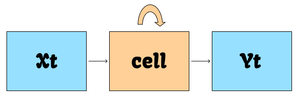
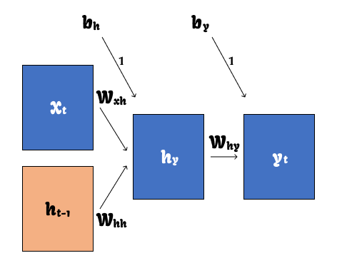

---
tags:
  - DL
  - RNN
---
# RNN

    순환 신경망 Recurrent Neural Network

## 기본 개념
- 자연어 문장처럼 토큰 input data 의 순서에 따라 의미가 달라지는 순차 데이터 Sequential Data 처리에 주로 사용하는 신경망
- Hidden Layer 노드에서 활성화 함수 Activation Function을 거친 결과값을 Output Layer로 보내는 동시에 다음 Hidden Layer 노드 입력값으로 보냄
  - ***순환신경망***

  
🔥 Feed-Forward Neural Network

    
    피드 포워드 신경망
    
  Hidden Layer에서 Activation Function을 통과한 결과 값이 오직 Output Layer로만 전달됨

<!-- 
 -->

<!-- 
 -->

<table>
  <thead>
    <tr>
      <th scope="col" style="text-align: center;">기호</td>
      <th scope="col" style="text-align: center;">뜻</td>
    </tr>
  </thead>
  <tbody style="text-align: center;">
    <tr>
      <td>$x$</td>
      <td>Input Layer의 입력 벡터</td>
    </tr>
    <tr>
      <td>$y$</td>
      <td>Output Layer의 출력 벡터</td>
    </tr>
    <tr>
      <td>$b$</td>
      <td>편향 bias</td>
    </tr>
    <tr>
      <td>$cell$</td>
      <td>Memory cell, RNN cell</td>
    </tr>
  </tbody>
</table>

- $cell$
  - Hidden Layer에서  Activation Function을 거쳐 결과를 내보내는 역할
  - 이전 Time Step의 출력값을 기억하는 역할
    - ***Memory cell***
- $cell$이 값을 기억한다?
  - 이전 Time Step에서 Hidden Layer의 메모리셀 출력값을 자기 자신의 입력값으로 재귀적Recursively으로 사용한다는 뜻

- Hidden State
  - 메모리 셀이 Output Layer 혹은 다음 Time Step의 메모리 셀에 보내는 값

- Time Step $(t-1)$ 의 Hidden State $h_{(t-1)}$ 를 다음 Time Step $(t)$ 의 Hidden State 계산을 위한 입력값으로 사용

## 수식

### $h_t = tanh(W_{xh}x_n + W_{hh}h_{t-1} + b_n)$
- $h_t$
  - $t$ 번째 Time Step에서의 Hidden State
- $W_{xh}$
  - 현재 입력값에 곱해지는 가중치
- $x_t$
  - 입력값
- $W_{hh}$
  - 이전 Time Step에서의 가중치
- $h_{t-1}$
  - $(t-1)$ 번째 Time Step에서의 Hidden State
- $b_h$
  - 편향
- $tanh$
  - 하이퍼볼릭 탄젠트, Activation Function 활성화 함수의 일종
  - Vanilla RNN *기본적인 RNN* 은 활성화 함수로 하이퍼볼릭 탄젠트를 사용하는 것이 특징

## 구조
- 입력 벡터와 출력 벡터 길이에 따른 3가지 구조

### One-to-Many

    
일대다 구조

┌───┐　┌───┐　┌───┐　┌───┐ 
│　$y_0$　│→│　$y_1$　│→│　$y_2$　│→│　$y_3$　│ 
└───┘　└───┘　└───┘　└───┘ 
　　 ↑ 　　　　　 ↑ 　　　　　 ↑ 　　　　　↑ 
┌───┐　┌───┐　┌───┐　┌───┐ 
│$RNN$│→│ $RNN$│→│$RNN$│→ │$RNN$│ 
└───┘　└───┘　└───┘　└───┘ 
　　 ↑ 
┌───┐ 
│　$x_0$　│ 
└───┘ 

- 이미지 캡셔닝에 활용

### Many-to-One

    
다대일 구조

.　　　　　　　　　　　　　　　　　　┌───┐ 
　　　　　　　　　　　　　　　　　　 │　$x_0$　│ 
　　　　　　　　　　　　　　　　　　 └───┘ 
　　　　　　　　　　　　　　　　　　　　 ↑ 
┌───┐　┌───┐　┌───┐　┌───┐ 
│$RNN$│→│ $RNN$│→│$RNN$│→ │$RNN$│ 
└───┘　└───┘　└───┘　└───┘ 
　　 ↑ 　　　　　 ↑ 　　　　　 ↑ 　　　　　↑ 
┌───┐　┌───┐　┌───┐　┌───┐ 
│　$x_0$　│→│　$x_1$　│→│　$x_2$　│→│　$x_3$　│ 
└───┘　└───┘　└───┘　└───┘ 

- 감정 분류, 스팸 메일 분류(T/F)에 활용

### Many-to-Many

    
다대다 구조

┌───┐　┌───┐　┌───┐　┌───┐ 
│　$y_0$　│→│　$y_1$　│→│　$y_2$　│→│　$y_3$　│ 
└───┘　└───┘　└───┘　└───┘ 
　　 ↑ 　　　　　 ↑ 　　　　　 ↑ 　　　　　↑ 
┌───┐　┌───┐　┌───┐　┌───┐ 
│$RNN$│→│ $RNN$│→│$RNN$│→ │$RNN$│ 
└───┘　└───┘　└───┘　└───┘ 
　　 ↑ 　　　　　 ↑ 　　　　　 ↑ 　　　　　↑ 
┌───┐　┌───┐　┌───┐　┌───┐ 
│　$x_0$　│→│　$x_1$　│→│　$x_2$　│→│　$x_3$　│ 
└───┘　└───┘　└───┘　└───┘ 

- 기계 번역, 챗봇에 활용

# Reference
<!-- [참조](https://ctkim.tistory.com/entry/RNNRecurrent-Neural-Network?category=1097443) -->
[참조](https://heytech.tistory.com/440)
