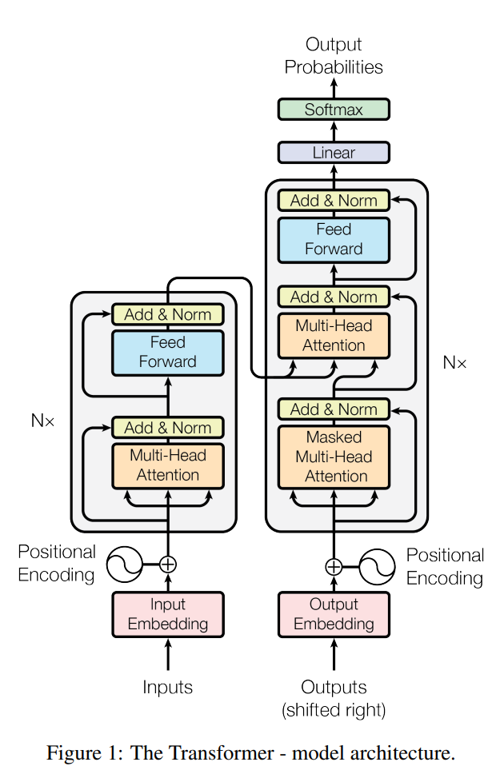
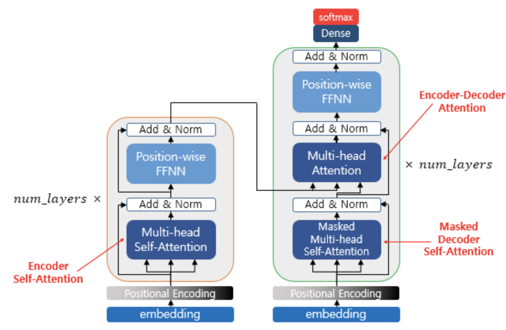

---
tags:
  - DL
---
# Transformer

[참조](https://blog-ko.superb-ai.com/what-is-the-transformer-model/)

[참조2](https://kaya-dev.tistory.com/8)

➰ "Attention is All You Need"

## Transformer Architecture

<br>

- Transformer = Encoder(left) + Decoder(right)

### Encoder&Decoder
- Positional Encoding
- Multi-Head Attention
- Add&Norm
- Feed-Forword

### Positional Encoding
    
    위치 정보를 벡터로 표현하는 것
    → Embedding된 값에 순서를 부여

- 기존 RNN 모델의 경우 순차적으로 Input Sentence를 입력 받음
    - `I` → `have` → `an` → `apple`
- Transformer 모델의 경우 Input Sentence를 한번에 입력
    - `I have an apple`
    - 모델에게 <span style="color: pink; font-weight: 600;">순서 정보</span>를 알려주어야 함
    - sine과 cosine은 주기함수이며 모든 값이 -1과 1 사이임에 착안
    - <span style="background: rgba(255,255,135,0.2);">Positional Encoding</span> 개념을 도입

#### $PE$
```r
$PE_{(pos,2_i)} = sin(pos/10000^{2_{i}/d_{model}})$
$PE_{(pos,2_i+1)} = cos(pos/10000^{2_{i}/d_{model}})$
```

|기호||의미|
|:-:|:-:|:-|
|$pos$||단어의 위치 *Position*|
|$i$||해당 $pos$ 단어의 *Embedding Dimension Index*|
|$d_{model}$||*Total Count of Embedding Dimension*|
<br>

> 예를 들어, `index=1`인 `"I"`가 `[0.1,0.2,0.3,0.4]`에 embedding된 경우 position encoding 연산
```r
$Position(1,0) = sin(1/10000^{(0/4)})$
$Position(1,1) = cos(1/10000^{(0/4)})$
$Position(1,2) = sin(1/10000^{(2/4)})$
$Position(1,3) = cos(1/10000^{(2/4)})$
```

#### *Model Input*
- Model Input Token = Embedding Dimension + PositionalEncoding
    - `Positional Encoding` 결과값을 기존 `Embedding` 값과 합 연산
    - $= [d_1+PE_{(pos,2_i)}, d_2+PE_{(pos,2_i+1)}, ..., d_n+PE_{(pos,x)}]$

```python
import torch

class PositionEncoding(nn.Module):
    def __init__(self, max_len, d_model, device) -> None:
        super(PositionalEncoding, self).__init__()

        self.encoding = torch.zeros(max_len, d_model, device=device)
        self.encoding.requires_grad = False
        # We don't need to compute gradient

        pos = torch.arange(0, max_len, device=device)
        pos = pos.float().unsqueeze(dim=1)

        _2i = torch.arange(0, d_model, step=2, device=device).float()

        self.encoding[:, 0::2] = torch.sin(pos/(10000**(_2i/d_model)))
        self.encoding[:, 1::2] = torch.cos(pos/(10000**(_2i/d_model)))
    
    def forward(self, x):
        batch_size, seq_len = x.size()

        return self.encoding[:seq_len, :]
```

### Multi-Head Attention
#### Self-Attention

    자기 자신에 대한 Attention 연산을 수행한다
    >>> 입력받은 문장만으로 Attention 연산을 수행한다

> Attention 연산을 수행함으로써 문장 내 단어간 유사성*Attention-Score*을 도출하여 단어와 단어 사이의 연관성을 이해할 수 있다.

- Transformer Model `Self-Attention`
    - `Encoder Self-Attention`
    - `Masked Decoder Self-Attention`
    - `Encoder-Decoder Self-Attention`


<br>

#### Scale Dot Product Attention
    
    입력 문서에서 중요 단어를 선별한다

#### Input Vector $Q$, $K$, $V$
- Input Sentence의 Embedding Size *(=d_model)* 를 동일, 축소
- Feed-Forward Network를 이용한 코드 구현
    - `torch.nn.Linear(d_model,n_head)`

##### Attention Score 계산
- $Attention(Q,K,V) = softmax(\frac{QK^T}{\sqrt{d_k}})V$
    - $Q$, $K$, $V$ → 행렬

- 입력 쿼리에 대해 $Key$ 단어들과 내적($Inner Product$)를 구하여 유사도 계산
- → $result^x/\sqrt{d_k} = Attention Score$
- → $Sum(Attention Score * Word Value) = Attention Value$

```python
import torch

class ScaleDotProductAttention(nn.Module):
    ```
    Compute scale dot product attention
    실질적인 attention score를 계산하는 클래스

    Query: given sentence that we focused on (decoder)
    Key: every sentence to check relationship with Query (encoder)
    Value: every sentence same with Key (endocer)
    ```
    def __init__(self):
        super(ScaleDotProductAttention, self).__init__()
        self.softmax = nn.Softmax()

    def forward(self, q, k, v, mask=None, e=1e-12):
        # Input is 4 dimension tensor
        # [batch_size, head, length, d_tensor]
        batch_size, head, length, d_tensor = k.size()

        # 1. Dot product Query with Keyᵀ to compute similarity
        k_t = k.view(batch_size, head, d_tensor, length)
        score = (q @ k_t) / math.sqrt(d_tensor)
        # @ 연산은 np.matmul 과 동일
```

#### Multi-Head Attention
- Scale dot product를 병렬로 사용
- `Multi-Head Attention`을 사용할 때 문장의 특징 정보를 더 많이 잡을 수 있음
- 다른 관점에서 문장을 이해할 수 있음
    - 다른 관점의 수 = `n_head`
- d_model을 n_head로 나눈 q,k,v에 대해 병렬 Attention을 수행
- 병렬 Attention 연산 결과를 합 연산(concatenate)
- 합 결과 행렬의 크기 = (seq_len, d_model)
- (seq_len, d_model) * 가중치 행렬 $W$ → Multi-Head Attention 최종 출력
    - 가중치 행렬 $W$ 의 shape = (d_model, d_model)

```python
import torch

class MultiHeadAttention(nn.Module):
    def __init__(self, d_model, n_head):
        super(MultiHeadAttention, self).__init__()
        self.n_head = n_head
        self.attention = ScaleDotProductAttention()
        self.w_q = nn.Linear(d_model, d_model)
        self.w_k = nn.Linear(d_model, d_model)
        self.w_v = nn.Linear(d_model, d_model)
        self.w_concat = nn.Linear(d_model, d_model)
    
    def split(self, tensor):
        ```
        splits tensor by number of head

        param tensor = [batch_size, length, d_model]
        out = [batch_size, head, length, d_tensor]

        d_model을 head와 d_tensor로 쪼갬
        d_tensor는 head 값에 따라 변함
        ```
        batch_size, length, d_model = tensor.size()

        d_tensor = d_model//self.n_head

        tensor = tensor.view(batch_size, self.n_head, length, d_tensor)

        return tensor

    def concat(self, tensor):
        ```
        inverse function of self.split(tensor=torch.Tensor)

        param tensor = [batch_size, head, length, d_tensor]
        out = [batch_size, length, d_model]
        ```
        batch_size, head, length, d_tensor = tensor.size()
        d_model = head * d_tensor

        tensor = tensor.view(batch_size, length, d_model)
        return tensor

    def forward(self, q, k, v, mask=None):
        # 1. dot product with weight metrics
        q, k, v = self.w_q(q), self.w_k(k), self.w_v(v)

        # 2. split tensor by number of heads
        q, k, v = self.split(q), self.split(k), self.split(v)

        # 3. do scale dot product to compute similarity (→ Attention 계산)
        out, attention = self.attention(q, k, v, mask=mask)

        # 4. concat and pass to linear layer
        out = self.concat(out)
        out = self.w_concat(out)

        return out
```

### Add & Norm
- Cell Add&Norm
    - Residual Connection과 Layer Normalization을 수행하는 단계

#### Residual Connection
- $H(x) = x + F(x)$
- 어떤 Sublayer F(x)의 출력값과 입력값인 x를 더한 결과를 출력값으로 사용하는 기법
- `Transformer`에서 `F(x)`는 `Multi-Head Attention`

#### Layer Normalization
- Batch Normalization의 단점을 보완하고 학습 속도를 향상시킨 기법
- 입력 텐서의 제일 마지막 차원의 평균과 분산을 구하고, 정규화를 진행

- 정규화 수식
    - $x̂_{i,k} = \frac{x_{i,k}-μ_{i}}{\sqrt{σ^2_i+ε}}$
    - $x_i$ 벡터 k번째 차원의 Normalization
    - $x_i$는 벡터, but 평균과 분산은 스칼라값
    - 따라서 벡터 $x_i$ 각 차원에 대한 정규화 수행
    - `epsilon`
        - 분모가 0이 되는 것을 방지하는 상수
        - $like$ 임의의 작은 양수
- gamma와 beta는 학습 가능한 파라미터
    - gamma $γ$
    - beta $β$
- $ln_i = γx̂_i + β = LayerNorm(x_i)$

```python
import torch

class LayerNorm(nn.Module):
    def __init__(self, d_model, eps=1e-12):
        super(LayerNorm, self).__init__()
        self.gamma = nn.Parameter(torch.ones(d_model))
        self.beta = nn.Parameter(torch.zeros(d_model))
        self.eps = eps
    
    def forward(self, x):
        mean = x.mean(-1, keepdim=True)
        std = x.std(-1, keepdim=True)
        # '-1' means last dimension

        out = (x - mean) / (std + self.eps)
        out = self.gamma * out + self.beta

        return out
```

### (Position-wise)Feed-Forward
- 완전연결신경망
- Transformer Encoder Decoder에 모두 사용하는 Sub-layer
    - Linear layer를 추가한다

- FFN 수식
    - $FFN(x) = max(0, _xW_1) W_2 + b_2$

- Linear layer를 거친 뒤 Relu 연산을 수행하고, 그 결과를 다시 Linear layer에 통과시킨다
- Input Value $x$
    - (seq_len, d_model) 사이즈
    - encoder, decoder 부분의 Multi-Head Attention 출력값
- FFN layer 입출력의 크기가 동일하도록 설정
    - w_1 (d_model, hidden)
    - w_2 (hidden, d_model)

```python
import torch

class PositionwiseFeedForward(nn.Module):
    def __init__(self, d_model, hidden, drop_prob=0.1):
        super(PositionwiseFeedForward, self).__init__()
        self.linear1 = nn.Linear(d_model, hidden)
        self.linear2 = nn.Linear(hidden, d_model)
        self.relu = nn.ReLU()
        self.dropout = nn.Dropout(p=drop_prob)

    def forward(self, x):
        x = self.linear1(x)
        x = self.relu(x)
        x = self.dropout(x)
        x = self.linear2(x)
        return x
```

## Encoder
### Encoder Layer Network

    1. Multi-Head Attention
    2. Add&Norm
    3. Feed-Forward
    4. Add&Norm

- $N$개의 `Encoder Layer`를 사용
- 하나의 Encoder Layer를 구현한 뒤 N개의 Encoder가 쌓여있는 Encoder를 구현하는 방식

### Encoder Layer Code
- 하나의 Encoder Layer를 구현

```python
import torch

class EncoderLayer(nn.Module):
    def __init__(self, d_model, ffn_hidden, n_head, drop_prob):
        super(EncoderLayer, self).__init__()

        # Multi-Head Attention
        self.attention = MultiHeadAttention(d_model, n_head)

        # Layer Normalization(Multi-Head Attention ->)
        self.norm1 = LayerNorm(d_model=d_model)
        self.dropout1 = nn.Dropout(p=drop_prob)

        # Feed-Forward
        self.ffn = PositionwiseFeedForward(d_model=d_model, hidden=ffn_hidden, drop_prob=drop_prob)

        # Layer Normalization(FFN ->)
        self.norm2 = LayerNorm(d_model=d_model)
        self.dropout2 = nn.Dropout(p=drop_prob)

    def forward(self, x, src_mask):
        _x = x

        # 1. Compute Multi-Head Attention
        x = self.attention(q=x, k=x, v=x, mask=src_mask)

        # 2. Compute add & norm
        x = self.norm1(x + _x)
        x = self.dropout1(x)

        # 3. Compute Feed-Forward Network
        _x = x
        x = self.ffn(x)

        # 4. Compute add & norm
        x = self.norm2(x + _x)
        x = self.dropout2(x)

        return x
```

### Encoder Code
- N개의 Encoder Layer를 이어 붙임

```python
import torch

class Encoder(nn.Module):
    def __init__(self, enc_voc_size, max_len, d_model, ffn_hidden, n_head, n_layers, drop_prob, device):
        super().__init__()

        # Embedding
        self.embed = nn.Embedding(num_embeddings=len(kor_text.vocab), embedding_dim=d_model, padding_idx=1)

        # Positional Encoding
        self.pe = PositionEncoding(max_len=max_len, d_model=d_model, device=device)

        # Add Multi Layers
        self.layers = nn.ModuleList(
            [
                EncoderLayer(
                    d_model=d_model,
                    ffn_hidden=ffn_hidden,
                    n_head=n_head,
                    drop_prob=drop_prob)
                for _ in range(n_layers)
            ])
    
    def forward(self, x, src_mask):
        # Compute Embedding
        x = self.emb(x)
        # sentence -> vector

        # Get Positional Encoding
        x_pe = self.pe(x)

        # Embedding + Positional Encoding
        x = x + x_pe

        # Compute Encoder Layers
        for layer in self.layers:
            x = layer(x, src_mask)
        
        # Return encoder output
        return x
```

## Decoder
- 총 2번의 Attention 계산
- 첫번째 Attention
    - Decoder 입력 만으로 Attention 계산 (Encoder와 동일)
- 두번째 Attention
    - 첫번째 Attention 결과 값이 두번째 Attention 계산의 Query로 들어가며,
    - Key와 Value 값은 마지막 Encoder 출력값이 들어감
- 이후 add&norm 부분과 Feed-Forward는 Encoder와 동일한 매커니즘으로 수행

### Decoder Layer Code
```python
import torch

class DecoderLayer(nn.Module):
    def __init__(self, d_model, ffn_hidden, n_head, drop_prob):
        super(DecoderLayer, self).__init__()

        # self attention (only Decoder input)
        self.self_attention = MultiHeadAttention(d_model=d_model, n_head=n_head)

        # layer normalization (first)
        self.norm1 = LayerNorm(d_model=d_model)
        # dropout(first)
        self.dropout1 = nn.Dropout(p=drop_prob)

        # attention (encoder + decoder)
        self.enc_dec_attention = MultiHeadAttention(d_model=d_model, n_head=n_head)

        # layer normalization (second)
        self.norm2 = LayerNorm(d_model=d_model)
        # dropout (second)
        self.dropout2 = nn.Dropout(p=drop_prob)

        # Feed-Forward
        self.ffn = PositionwiseFeedForward(d_model=d_model, hidden=ffn_hidden, drop_prob=drop_prob)

        # Layer Normalization (third)
        self.norm3 = LayerNorm(d_model=d_model)
        # dropout (third)
        self.dropout3 = nn.Dropout(p=drop_prob)

    def forward(self, dec, enc, trg_mask, src_mask):
        _x = dec

        # Compute self-attention
        x = self.self_attention(q=dec, k=dec, v=dec, mask=trg_mask)

        # Compute add&norm
        x = self.norm1(x+_x)
        x = self.dropout1(x)

        if enc is not None:  # encoder의 출력값이 있다면,(없으면 FFN으로 넘어감)
            _x = x

            # Compute encoder - Decoder attention
            # Query(q): Decoder attention output
            # Key(k): Encoder output
            # Value(v): Encoder output
            x = self.enc_dec_attention(q=x, k=enc, v=enc, mask=src_mask)

            # Compute add&norm
            x = self.norm2(x+_x)
            x = self.dropout2(x)

        _x = x

        # Compute FFN
        x = self.ffn(x)

        # Compute add&norm
        x = self.norm3(x + _x)
        x = self.dropout3(x)

        return x
```

### Decoder Code
- 하나의 Decoder Layer를 여러 개로 이어 하나의 Decoder 객체로 구성
- Embedding과 Positional Encoding 추가

```python
import torch

class Decoder(nn.Module):
    def __init__(self, dec_voc_size, max_len, d_model, ffn_hidden, n_head, n_layers, drop_prob, device):
        super().__init__()

        # Embedding
        self.embed = nn.Embedding(num_embeddings=len(eng_text, vocab), embedding_dim=d_model, padding_idx=1)

        # Positional Encoding
        self.pe = PositionalEncoding(max_len=50, d_model=d_model, device='cuda')

        # Add decoder layers
        self.layers = nn.ModuleList([
            DecoderLayer(
                d_model=d_model,
                ffn_hidden=ffn_hidden,
                n_head=n_head,
                drop_prob=drop_prob
            )
            for _ in range(n_layers)
        ])

        # Linear
        self.linear = nn.Linear(d_model, dec_voc_size)

    def forward(self, trg, src, trg_mask, src_mask):
        # Compute Embedding
        trg = self.embed(trg)

        # Get Positional Encoding
        trg_pe = self.pe(trg)

        # Embedding + Positional Encoding
        trg += trg_pe

        # Compute Decoder Layers
        for layer in self.layers:
            trg = layer(trg, src, trg_mask, src_mask)

        # pass to LM head
        output = self.linear(trg)

        return output
```

## Transformer 구현하기
- Encoder와 Decoder를 하나의 모델로 병합
- 이때, Mask도 생성하여 입력해줌

```python
import torch

class Transformer(nn.Module):
    def __init__(self, src_pad_idx, trg_pad_idx, trg_sos_idx, enc_voc_size, dec_voc_size, d_model, n_head, max_len, ffn_hidden, n_layers, drop_prob, device):
        super().__init__()
        # Get <PAD> index
        self.src_pad_idx = src_pad_idx
        self.trg_pad_idx = trg_pad_idx
        self.trg_sos_idx = trg_sos_idx

        # Encoder
        self.encoder = Encoder(
            enc_voc_size=enc_voc_size,
            max_len=max_len,
            d_model = d_model,
            ffn_hidden=ffn_hidden,
            n_head=n_head,
            n_layers=n_layers,
            drop_prob=drop_prob,
            device=device
        )

        # Decoder
        self.decoder = Decoder(
            dec_voc_size=dec_voc_size,
            max_len=max_len,
            d_model=d_model,
            ffn_hidden=ffn_hidden,
            n_head=n_head,
            n_layers=n_layers,
            drop_prob=drop_prob,
            device=device
        )
        self.device = device
    
    def make_pad_mask(self, q, k):
        # padding 부분은 attention 연산에서 제외해야 하므로 mask를 씌워 계산되지 않도록
        len_q, len_k = q.size(1), k.size(1)
        print(len_k)
        # batch_size x 1 x 1 x len_k
        k = k.ne(self.src_pad_idx).unsqueeze(1).unsqueeze(2)
        print(k.shape)
        # batch_size x 1 x len_1 x len_k
        k = k.repeat(1, 1, len_q, 1)

        # batch_size x 1 x len_q x 1
        q = q.ne(self.src_pad_idx).unsqueeze(1).unsqueeze(3)
        # batch_size x 1 x len_q x len_k
        q = q.repeat(1, 1, 1, len_k)

        mask = k & q

        return mask

    def make_no_peak_mask(self, q, k):
        # Decoder 부분에서 t번째 단어를 예측하기 위해 t-1번째 단어까지 입력 → 나머지 부분을 masking
        
        len_q,len_k = q.size(1),k.size(1)
        
        # 만약 t번째 단어를 예측하는데 이미 decoder에 t번째 단어가 들어간다면 답을 이미 알고 있게 되므로
        # Seq2Seq 모델처럼 t번째 단어를 예측하기 위해서 t-1번째 단어까지만 입력될 필요가 있음
        # (나머지 t,t+1,...,max_len)까지 단어는 Masking
        
        # len_q x len_k (torch.tril = 하삼각행렬)
        mask = torch.tril(torch.ones(len_q,len_k)).type(torch.BoolTensor).to(self.device)
        
        return mask
    
    def forward(self,src,trg):
        # Get Mask
        src_mask = self.make_pad_mask(src,src)
        src_trg_mask = self.make_pad_mask(trg,src)
        trg_mask = self.make_pad_mask(trg,trg) * self.make_no_peak_mask(trg,trg)
        
        # Compute Encoder
        enc_src = self.encoder(src,src_mask)
        
        # Compute Decoder
        output = self.decoder(trg,enc_src,trg_mask,src_trg_mask)
        
        return output
```

